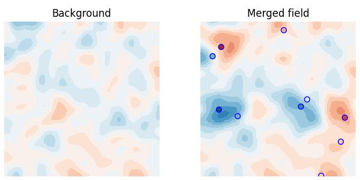

# Gridded post-processor

[](https://github.com/metno/gridpp/releases)
[](https://github.com/metno/gridpp/actions)

Gridpp a is post-processing tool for gridded weather forecasts. It consists of a **library** of commonly-used methods and a **command-line tool** that applies these methods to forecast fields in NetCDF files.

Gridpp is written in C++ but offers python bindings to the functions in the library. The tool is used at MET Norway to produce operational weather forecasts for Yr (https://www.yr.no).

Gridpp is currently under active development and the current version is a prototype for testing. We welcome
suggesions for improvements.

## Features
- Methods for **downscaling** a forecast from a coarse grid to a fine grid
- Methods for **calibrating** a downscaled grid, such as quantile mapping
- Computationally efficient **neighbourhood** methods to compute neighbourhood min, mean, max, and any quantile.
- Data assimilation using **optimal interpolation** (OI) to merge observations and gridded forecasts (deterministic or ensemble)
- Efficient data structures for nearest location lookup in a vector or grid of locations
- Command-line client with support for Netcdf files with flexibility in how variables and dimensions are configured

## Resources
For information on how to use gridpp, check out the wiki at https://github.com/metno/gridpp/wiki. The API
reference is found at https://metno.github.io/gridpp/. Found a bug? Please report it in the **issue
tracker** at https://github.com/metno/gridpp/issues. Reach out to the gridpp community in the **discussions**
at https://github.com/metno/gridpp/discussions. Or contact Thomas Nipen (thomasn@met.no) directly.

## Getting started

The easiest way to get started is to install gridpp for python using:
```
pip install gridpp
```

Let's say you have a gridded background field and want to merge this with a set of point observations. We can use
`gridpp.optimal_interpolation()` for this! Just run the following:

```python
import gridpp
import numpy as np
import scipy.ndimage.filters

# Create a nice background field and define its grid
noise = np.random.randn(200, 200) * 3
field = scipy.ndimage.filters.gaussian_filter(noise, sigma=5)
grid = gridpp.Grid(*np.meshgrid(np.linspace(0, 1, 200), np.linspace(0, 1, 200)))

# Next, create some trustworthy observations
points = gridpp.Points(np.random.rand(10), np.random.rand(10))
obs = np.random.randn(10) / 2
pobs = gridpp.nearest(grid, points, field)
obs_to_background_variance_ratio = 0.5*np.ones(10)

# Run optimal interpolation with a Barnes structure function (10km e-folding distance)
structure = gridpp.BarnesStructure(10000)
max_points = 10
output = gridpp.optimal_interpolation(grid, field, points, obs,
                                      obs_to_background_variance_ratio,
                                      pobs, structure, max_points)
```



## Full gridpp installation from source

### 1) Install dependencies
- [Boost](https://www.boost.org/) >= 1.59
- [Armadillo](http://arma.sourceforge.net/) >= 6.6
- [GNU Scientific Library](https://www.gnu.org/software/gsl/)
- [Netcdf](https://www.unidata.ucar.edu/software/netcdf/)

On Ubuntu Bionic, these can be installed like this:
```bash
sudo apt-get update
sudo apt-get install libboost-all-dev
sudo apt-get install libgsl0-dev libblas-dev
sudo apt-get install netcdf-bin libnetcdf-dev
sudo apt-get install libarmadillo6 libarmadillo-dev
sudo apt install swig cmake
```

Note that Ubuntu Xenial only has Armadillo 6.5 in its apt repository. In that case you need to install  [Armadillo 6.6](http://arma.sourceforge.net/) or later manually.


### 2) Download source code

Either download the source code from the [latest release](https://github.com/metno/gridpp/releases), unzip
   the file and navigate into the extracted folder; or clone the repo from github.

### 3) Set up cmake installation

```bash
mkdir build
cd build
cmake ..
```

### 4) Install the C++ library

```bash
sudo make install
```
This will install the library in `/usr/local/lib/libgridpp.so` and the gridpp command-line client in
`/usr/local/bin/gridpp`. To specify a custom installation path, use the following in step 3:

```bash
cmake .. -DCMAKE_INSTALL_PREFIX=<custom path>
```

### 5) Install the python bindings

```bash
make install-python-user
```

This installs the python bindings in
`~/local/lib/python3.6/site-packages/gridpp.py`. To install the python bindings system-wide, use `sudo make install-python` instead.

If you only want to build the package, and want to install it in a custom location instead, run:
```bash
make build-python
```

and copy `extras/SWIG/python/gridpp.py` and `extras/SWIG/python/_gridpp.so` to the desired location.

### 6) Install the R bindings

```bash
make build-r
```

Currently, the R package is not installed centrally, but instead is placed in `extras/SWIG/R/gridpp.R` in the build directory.

## gridpp client installation from source

1. Extra dependencies
The gridpp commando-line client requires the following extra dependencies:
- [GNU Scientific Library](https://www.gnu.org/software/gsl/)
- [Netcdf](https://www.unidata.ucar.edu/software/netcdf/)

On Ubuntu Bionic, these can be installed like this:
```bash
sudo apt-get install libgsl0-dev libblas-dev
sudo apt-get install netcdf-bin libnetcdf-dev
```

2. Install the client
```bash
make gridpp-client
```

## Copyright and license
Copyright © 2014-2024 Norwegian Meteorological Institute. Gridpp is licensed under the GNU LEsser General
Public License (LGPL). See LICENSE file.
